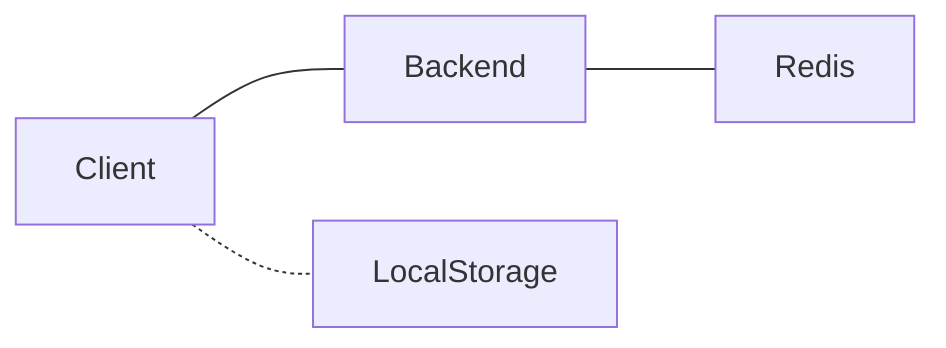

# Wordle

Link to vercel deployment (written in typescript / Angular) (latest): https://wordle-andreas.vercel.app/  
Link to github pages deployment (written in typescript / Angular) (latest, cached -> user needs to refresh to get latest deployment): https://andreashsy.github.io/wordle/  

Objective of the game:
Guess a five-letter word

Rules:
You have 6 guesses
Guesses must be a word (based on a list of 3,400+ words, may not contain all words)
Letters that are in the word and in the correct position are coloured green.
Letters that are in the word but not in the correct position are coloured yellow.
Letters that are not in the word are coloured grey.
Enjoy!

Original game by Josh Wardle - https://www.powerlanguage.co.uk/wordle/

This project was generated with [Angular CLI](https://github.com/angular/angular-cli) version 13.2.0.

## Project Architecture

Frontend (Angular/Typescript): Contains everything to run the game (game logic, list of valid words, etc). Individual player statistics saved to local storage.

Backend (SpringBoot/Java, Redis): Backend written using SpringBoot, connects to a Redis instance. Saves player comments, word suggestions (Ideally would be SQL database, but using Redis due to cost constraints)

## Development server

Run `ng serve` for a dev server. Navigate to `http://localhost:4200/`. The app will automatically reload if you change any of the source files.

## Code scaffolding

Run `ng generate component component-name` to generate a new component. You can also use `ng generate directive|pipe|service|class|guard|interface|enum|module`.

## Build

Run `ng build` to build the project. The build artifacts will be stored in the `dist/` directory.

## Running unit tests

Run `ng test` to execute the unit tests via [Karma](https://karma-runner.github.io).

## Running end-to-end tests

Run `ng e2e` to execute the end-to-end tests via a platform of your choice. To use this command, you need to first add a package that implements end-to-end testing capabilities.

## Further help

To get more help on the Angular CLI use `ng help` or go check out the [Angular CLI Overview and Command Reference](https://angular.io/cli) page.
